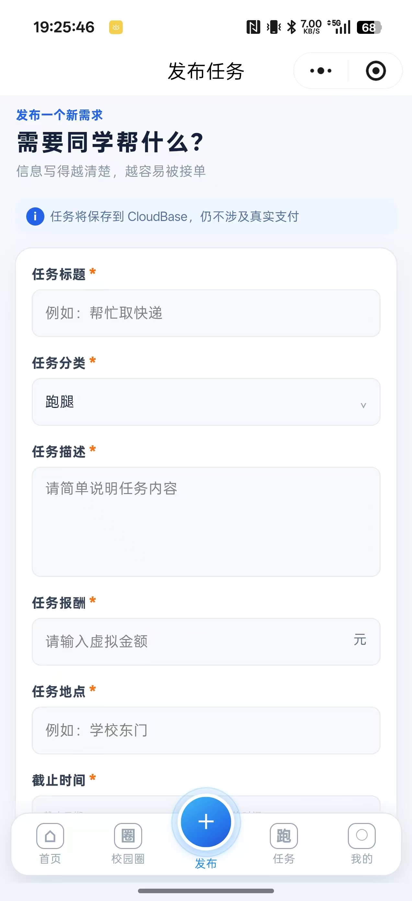
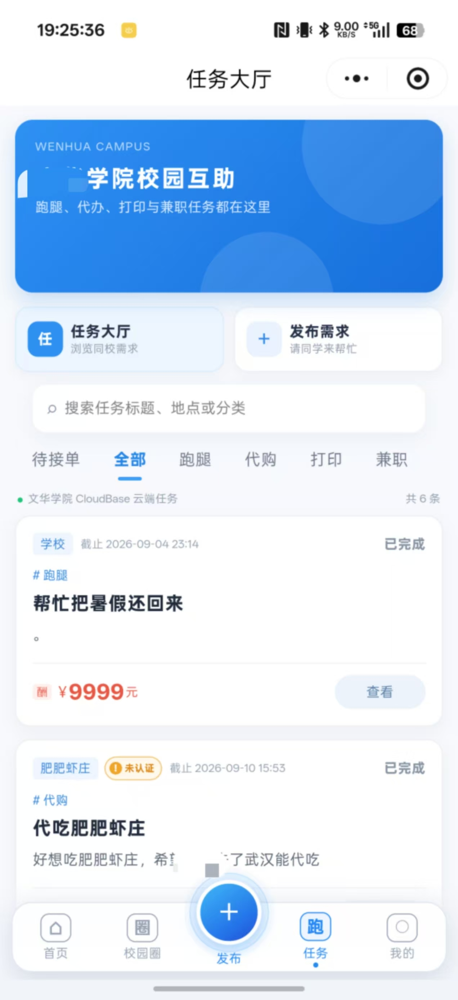
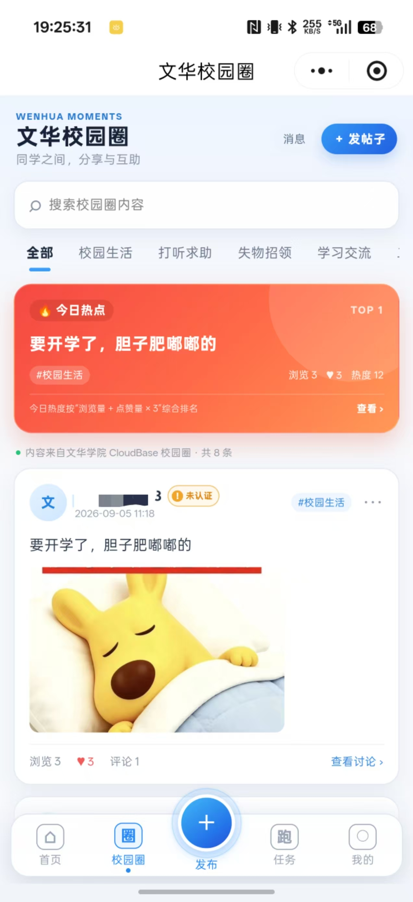
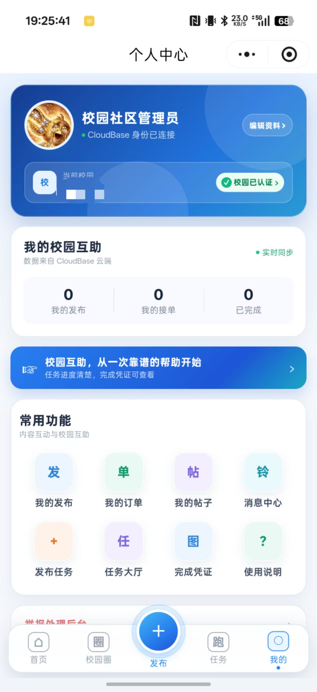
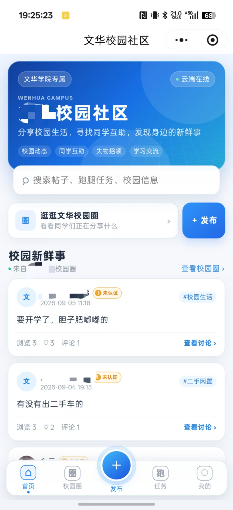

# 校园社区

校园社区是一个基于微信小程序和腾讯云 CloudBase 的校园社区示例项目，包含校园圈互动、任务发布、接单、完成凭证、订单进度、校园认证、举报处理和服务通知等功能。

> 当前版本是测试版示例，不代表真实支付、担保、托管或赔付服务。

## 功能概览

- 校园圈：分类发帖、图片、点赞、评论、回复、热帖展示
- 互助任务：发布、接单、提交完成凭证、发布者确认
- 任务进度：发布者与接单者看到不同的操作入口
- 安全能力：未认证提示、内容安全检查、图片安全检查、举报与争议反馈
- CloudBase：云函数、数据库权限建议、索引配置和微信订阅消息
- 隐私选项：任务支持匿名发布
- ## 小程序截图

### 发布任务

### 任务大厅

### 个人中心

### 校园圈

### 首页

## 开始使用

1. 安装微信开发者工具。
2. 导入本目录。
3. 在 `project.config.json` 中填写你自己的小程序 AppID。
4. 在 `app.js` 中填写你自己的 CloudBase 环境 ID。
5. 在 `cloudfunctions/serviceNotification/template-config.js` 和 `utils/subscription-config.js` 中填写自己的订阅消息模板 ID；不使用服务通知时可以关闭相关入口。
6. 创建 CloudBase 数据库和云存储。
7. 按 `cloudbase-config/README.md` 配置数据库权限与索引。
8. 为每个 `cloudfunctions/*` 目录安装 `wx-server-sdk` 并部署云函数。

## 云函数部署

在微信开发者工具中选择“云函数”目录并逐个部署。生产环境建议先完成权限、索引、内容安全和订阅消息配置，再开放给真实用户。

## 数据安全

- 不要把真实用户数据、导出的数据库记录或个人隐私文件提交到仓库。
- 数据库业务集合建议设置为“仅管理端可读写”，由云函数执行身份校验和业务写入。
- 云存储应限制为创建者可读写，并通过云函数生成临时访问地址。
- 管理员账号和管理员权限不要写死在前端代码中。
- 正式上线前请重新检查所有云函数的权限、限流和错误处理。

## 免责声明

本项目仅供学习、测试和二次开发使用。项目中的任务金额为测试展示，不构成支付、担保、托管、赔付或交易承诺。部署者需要自行遵守微信小程序、腾讯云、网络安全、隐私保护及校园管理相关规定。

## 开源协议

本项目采用 MIT License，详见 [LICENSE](LICENSE)。
